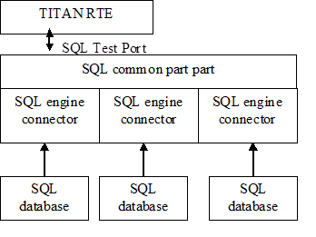

= SQL Test Port for TTCN-3 Toolset with TITAN Description
:author: Gábor Szalai
:toc: left

== System Requirements

In order to operate the SQL test port the following system requirements must be satisfied:

* Platform: any platform supported by TITAN RTE and the used SQL engine
* TITAN TTCN-3 Test Executor version R8A (1.8.pl0) or higher installed. For installation guide see <<_2, [2]>>.

NOTE: This version of the test port is not compatible with TITAN releases earlier than R8A.

* The run time and the development libraries of the used SQL engine.
* SQLite engine required sqlite3 development library version 3.6.5 or later.

== Fundamental Concepts

The SQL test port executes SQL statement against the SQL database. The SQL test port is able to handle different SQL engines and databases, and provides a unified interface towards them.

== Overview

The communication between the SQL test port and the TITAN RTE is done by using the API functions described in <<_2, [2]>>. The SQL test port then transfers the SQL messages to the SUT.

The test port supports several parallel database connection.

See the overview of the system below:

== SQL Test Port API

The SQL test port is a procedure based test port with the following procedures:

* `S_SQL_connect` - Open a connection towards the SQL database.

* `S_SQL_Query` - Execute the SQL query.

* `S_SQL_disconnect` - Close the connection.

== Installation

Since the SQL test port is used as a part of the TTCN-3 test environment this requires TTCN-3 Test Executor to be installed before any operation of the SQL test port. For more details on the installation of TTCN-3 Test Executor see the relevant section of <<_2, [2]>>.

In order to use different SQL engines the runtime and development libraries of the SQL engine should be installed.

== Configuration

The executable test program behavior is determined via the run time ASPs

=== SQL Test Port Parameters in the RTE Configuration File

None.

== SQL Engine Connectors

=== MySQL Connector

Provides an interface towards the MySQL database via the MySQL C API. See <<_4, [4]>>.

==== Requirements

The MySQL C API libraries should be installed. See <<_4, [4]>>.

==== Parameters

* `host` +
The value of host may be either a host name or an IP address. If host is "localhost", a connection to the local host is assumed. For Windows, the client connects using a shared-memory connection, if the server has shared-memory connections enabled. Otherwise, TCP/IP is used. For Unix, the client connects using a Unix socket file. For a host value of "." on Windows, the client connects using a named pipe, if the server has named-pipe connections enabled. If named-pipe connections are not enabled, an error occurs.

* `user` +
The `user` parameter contains the user's MySQL login ID. If user is NULL or the empty string "", the current user is assumed. Under Unix, this is the current login name. Under Windows ODBC, the current user name must be specified explicitly.

* `password` +
The `password` parameter contains the password for user. If password is empty, only entries in the user table for the user that have a blank (empty) `password` field are checked for a match.

* `database` +
`database` is the database name.

* `port` +
If `port` is not `_0_`, the value is used as the port number for the TCP/IP connection.
+
NOTE: The host parameter determines the type of the connection.

* `unix_socket` +
If `unix_socket` is not empty, the string specifies the socket or named pipe to use.
+
NOTE: The host parameter determines the type of the connection.

* `client_flag` +
The value of this flag is usually 0 but can be set to a combination of the following flags to enable certain features.

* `char_set` +
The name of the character set to use as the default character set.

* `auto_reconnect` +
Enable or disable automatic reconnection to the server if the connection is found to have been lost. Reconnect has been off by default since MySQL 5.0.3; this option is new in 5.0.13 and provides a way to set reconnection behavior explicitly.

* `connect_timeout` +
The connect timeout in seconds. Default value is 5 seconds.

=== SQLite Connector

Provides an interface towards the SQLite database via the SQLite C API. See <<_5, [5]>>.

[[requirements-0]]
==== Requirements

The SQLite C API libraries should be installed. See <<_5, [5]>>.

[[parameters-0]]
==== Parameters

* `database` +
Path to the SQLite database file. It is a mandatory field.
* `type` +
The type of the database. There are three open methods available on the database: `utf8`, `utf16`, `v2`. Use these three values with the `type` parameter. If the parameter is not specified the default value is used.
+
The default value is `_utf8_`.

* `flags` +
Sets how to open the database (read/write access). For more details about flags see <<_5, [5]>>.
* `max_busy_retries` +
When the database is busy, the SQLite engine can stop after `max_busy_retries`.
+
The default behavior: do while database is busy.

=== Oracle SQL Connector

The Oracle SQL connector provides an interface for Oracle SQL database using the Oracle OCCI

[[requirements-1]]
==== Requirements

The Oracle Insta Client SDK should be installed.

[[parameters-1]]
==== Parameters

* `connection_string` T- he Oracle SQL connection string. For details see the Oracle manual. It’s mandatory field.
* `user` - The name of the database user.
* `password` - The password of the user.

== Rollback

The SQL testport can run and rollback your SQL queries specified in a separated SQL file. We can support some limited SQL functionality in our product. See the supported SQL syntax in the following chapters. SELECT statement is not supported in the feature and in the SQL file.

Both MySQL and SQLite syntax is available.

=== CREATE DATABASE

[source,sql]
----
CREATE DATABASE database_name
----

=== CREATE TABLE

[source,sql]
----
CREATE TABLE table_name (create_definition)
create_definition: column_name column_definition
column_definition: data_type [NOT NULL | NULL] [DEFAULT default_value] [AUTO_INCREMENT|AUTOINCREMENT] [UNIQUE [KEY]] [[PRIMARY] KEY]
data_type: data_type: BIT optional_length
| TINYINT optional_length
| SMALLINT optional_length
| MEDIUMINT optional_length
| INT optional_length
| DTINTEGER optional_length
| BIGINT optional_length
| REAL optional_length
| DOUBLE optional_length
| DTFLOAT optional_length
| DECIMAL optional_length
| NUMERIC optional_length
| DATE
| TIME
| TIMESTAMP
| DATETIME
| YEAR
| DTCHAR optional_length
| VARCHAR optional_length
| BINARY optional_length
| VARBINARY optional_length
| TINYBLOB
| BLOB
| MEDIUMBLOB
| LONGBLOB
| TINYTEXT
| TEXT
| MEDIUMTEXT
| LONGTEXT
| ENUM enum_list
| SET enum_list
optional_length: (INTNUM)
  | (INTNUM, INTNUM)
----

=== DELETE

Only the single table format supported.

[source,sql]
----
DELETE FROM table_reference optional_where optional_orderby optional_limit
optional_where: WHERE expression
optional_orderby: ORDER BY [column_name, column_number, column_name_list, column_number_list] [ASC, DESC]
optional_limit: LIMIT limit_number
----

=== INSERT

Only the single table format supported

[source,sql]
----
INSERT INTO table_reference (column_list) VALUES (value_list)
  | INSERT INTO table_reference VALUES (value_list)
----

=== UPDATE

[source,sql]
----
UPDATE table_reference SET expression_list optional_where optional_orderby optional_limit
optional_where: WHERE expression
optional_orderby: ORDER BY [column_name, column_number, column_name_list, column_number_list] [ASC, DESC]
optional_limit: LIMIT limit_number
----

=== Function List

[[substr-ing-value-list]]
==== SUBSTR(ING)(_value_list_)

[source,sql]
----
  | SUBSTR(ING)(expression FROM expression )
  | SUBSTR(ING)( expression FROM expression FOR expression)
----

==== ASCII (expression)

[[bin-expression]]
==== BIN(expression)

[[bit-length-expression]]
==== BIT_LENGTH(expression)

[[concat-expression]]
==== CONCAT(expression)

==== CURDATE()

[[current-date]]
==== CURRENT_DATE()

[[current-time]]
==== CURRENT_TIME()

==== CURTIME()

==== DATE()

[[date-add-expression-interval-expression]]
==== DATE_ADD(expression, interval_expression)

[source,sql]
----
interval_expression: INTERVAL expression interval_value_list
interval_value_list: YEAR
  | MICROSECOND
  | SECOND
  | MINUTE
  | HOUR
  | DAY
  | WEEK
  | MONTH
  | QUARTER
  | SECOND_MICROSECOND
  | MINUTE_MICROSECOND
  | MINUTE_SECOND
  | HOUR_MICROSECOND
  | HOUR_SECOND
  | HOUR_MINUTE
  | DAY_MICROSECOND
  | DAY_SECOND
  | DAY_MINUTE
  | DAY_HOUR
  | YEAR_MONTH
----

[[date-sub-expression-interval-expression]]
==== DATE_SUB(expression, interval_expression)

[[hex-expression]]
==== HEX(expression)

[[lcase-expression]]
==== LCASE(expression)

[[lower-expression]]
==== LOWER(expression)

[[length-expression]]
==== LENGTH(expression)

==== NOW()

[[reverse-expression]]
==== REVERSE(expression)

[[space-expression]]
==== SPACE(expression)

[[time-expression]]
==== TIME(expression)

[[trim-value-list]]
==== TRIM(value_list)

[source,sql]
----
| TRIM(trim_ltb  expression FROM value_list)
trim_ltb: LEADING
| TRAILING
| BOTH
----

[[uhex-expression]]
==== UHEX(expression)

[[upper-expression]]
==== UPPER(expression)

=== Environment Variables

The SQL file, used in the Rollback process, can also contain environment variables declared by the user. Both `$VARIABLE_NAME` and `$\{VARIABLE_NAME}` format are accepted and the parser will replace the variables with their values. The environment variables can be used as table names, column names and as attribute values.

== _Makefile_

The _Makefile_ has to include the SQL related linking instructions:

[source]
----
$(TARGET): $(OBJECTS)
	$(CXX) $(LDFLAGS) -o $@ $^ \
	-L$(TTCN3_DIR)/lib -L$(OPENSSL_DIR)/lib -L$(XMLDIR)/lib \
	-l$(TTCN3_LIB) -lcrypto -lmysqlclient -lz -lsqlite3 \
	$($(PLATFORM)_LIBS) \
	|| if [ -f $(TTCN3_DIR)/bin/titanver ]; then $(TTCN3_DIR)/bin/titanver $^; else : ; fi
----

== Examples

The "demo" directory of the deliverable contains the file __SQL_demo.ttcn__. It contains the test cases *_MySQL_Test_Demo_* and *_SQLite_Test_Demo_* which demonstrate the SQL "SELECT" query.

The __SQL_Parser.ttcn__ shows how to use the rollback feature.

== Function Specification

=== Implementation

The SQL Test port consists of two layers:

* Common part: +
Responsible for the common functions of the SQL test port. The common part provide an unified interface towards the TTCN test suite.

* SQL engine connectors: +
Provides a connection towards the specific SQL engines. Handles the SQL engine specific functions.

=== Configuration

The configuration of the SQL test port is done via the run time ASPs

=== Start Procedure

During the start up of the SQL test port, the SQL engine connectors register their handlers in the common part.

[[sending-receiving-sql-asps]]
=== Sending/Receiving SQL ASPs

The common part handles the ASP call from the test suite, and forwards them to the appropriate SQL engine connector. The SQL engine connector connects to the database, executes the SQL query, and send back the result of the query to the common part. The common part converts the result into TTCN-3 data and forwards to the test suite.

==== Closing Down

The SQL test port closes down the active SQL connections.

==== Logging

The logging printouts will be directed to the RTE log file.

==== Error Handling

Erroneous behavior detected during runtime is shown on the console and directed into the RTE log file. The following two types of messages are taken care of:

* Errors: information about errors detected is provided. If an error occurs the execution will stop immediately.
* Warnings: information about warnings detected is provided. The execution continues after the warning is shown.

=== Functions and Rollback

In __SQL_Functions.ttcn__ there are some useful functions to use the SQL TestPort.

[[f-connect]]
==== `f_connect`

[source,subs="quotes"]
----
*function* f_connect(*inout* SQLasp_PT pl_port, *in* SQL_Connection pl_connection, *out* SQL_Result pl_result, *out* SQL_exception pl_exception) *return* boolean
----

Can connect the testport to the connection.

[[f-query]]
==== `f_query`

[source,subs="quotes"]
----
*function* f_query(*inout* SQLasp_PT pl_port, *in* integer pl_connId, *in* SQL_Query pl_query, *out* SQL_Query_result pl_result, *out* SQL_exception pl_exception) *return* boolean
----
Runs the query on the testport with the given connection id.

[[f-disconnect]]
==== `f_disconnect`

[source,subs="quotes"]
----
*function* f_disconnect(*inout* SQLasp_PT pl_port, *in* integer pl_connId, *out* SQL_Result pl_result, *out* SQL_exception pl_exception) *return* boolean
----
Disconnects the port with the given connection id.

[[ef-sql-execute]]
==== `ef_SQL_Execute`

[source,subs="quotes"]
----
*external function* ef_SQL_Execute (*in* charstring pl_sql_file, *inout* SQLasp_PT pl_sqlPort, *in* integer pl_connId, *in* SQL_Primary_Keys pl_primary_keys, *out* SQL_Rollback_Queries pl_result, *out* SQL_Query_Result_Record pl_result_record) *return* boolean;
----

Execute and generate the rollback queries. You have to specify the used tables’s primary key. This function just executes the original commands and creates the rollback functions. To do the rollback use the `f_SQL_Rollback`

`pl_sql_file`- path to the sql file.

`pl_primary_keys`- record of primary keys (for example: \{\{"table1", "key1"}, \{"table2", "key2"}}

`pl_result`- holds the rollback queries. If you run these queries, you can rollback your database into the original state.

`pl_result_record`- holds the record of the original queries result data. If the statement won’t update, insert or delete anything, it won’t register neither in the result record nor in the result.

[[f-sql-rollback]]
==== `f_SQL_Rollback`

[source,subs="quotes"]
----
*function* f_SQL_Rollback(*inout* SQLasp_PT pl_sqlPort, *in* integer pl_connId, *inout* SQL_Rollback_Queries pl_queries)
----

If you have the rollback queries you can run them with this function. From the last to the first. If you caught an exception while the rollback, in the `pl_queries` the function will return the remaining queries. If it is empty, the rollback was complete.

== Error Messages

The following Error messages are generated by the test port. Description is also included if the message is not self-evident.

=== SQLite Interface

`*You have to specify positive max_busy_retries parameter.*`

`*Max retry reached. Giving up.*`

`*Database attribute is not specified. eg: file:/home/path/mydb.db*`

The mandatory "database" configuration file parameter is missing.

`*The SQLite engine is not connected to the database. Please connect first.*`

An SQL query is attempted without first sending an `SQL_Connect`.

`*Unknown field type*`

The field (column) received by the test port is not recognized.

`*Error with query.*``

Query has been attempted but resulted in error.

`*The database connection is associated with unfinalized prepared statements or unfinished sqlite3_backup objects.*``

Termination of the connection to the database is not successful.

`*Step is <result type> not SQLITE_ROW!*`

Only SQLITE_ROW result type can be returned after SQL SELECT.

`*Error while query: <result type>*`

Could not start query.

=== MySQL Interface

`*ERROR: Can not initialize the MySQL library. The mysql_init returned NULL.*`

Unsuccessful initialization of MySQL connection based on the given parameters.

`*MySQL connect failed with error message: <error_message>.*``

Unsuccessful connection to MySQL. The error message is returned by MySQL. See <<_4, [4]>> for details.

`*The MySQL engine isn't connected to the database. Please connect first.*``

A MySQL query is attempted without first sending an `SQL_Connect`.

`*The SQL query failed with error message: <error_message>.`*

Unsuccessful query.The error message is returned by MySQL. See <<_4, [4]>> for details.

`*The mysql_store_result failed with error message: <error_message>.*`

The error message is returned by MySQL. See <<_4, [4]>> for details.

MySQL can return with other error messages. They can come directly from the MySQL server, so for more details see <<_4, [4]>>.

== Warning Messages

The following Warning Message is generated by the test port. Description is also included if the message is not self-evident.

=== SQLite interface

`*_Database is busy. <repetition_number>. Retry: <query>._*`

When the database is busy the test port retries the operation. By default the test port retries until success. If the `max_busy_retries` parameter is set then the attempts will be limited by this number.

== Abbreviations

ASP:: Abstract Service Primitive

RTE:: Run-Time Environment

SUT:: System Under Test

TTCN-3:: Testing and Test Control Notation version 3

SQL:: Structured Query Language

== References

[[_1]]
[1] ETSI ES 201 873-1 (2002) +
The Testing and Test Control Notation version 3. Part 1: Core Language

[[_2]]
[2] User Guide for TITAN TTCN–3 Test Executor

[[_3]]
[3] https://www.mysql.com/

[[_4]]
[4] https://www.sqlite.org/index.html

[[_5]]
[5] http://dev.mysql.com/doc/refman/5.0/en/mysql-real-connect.html
